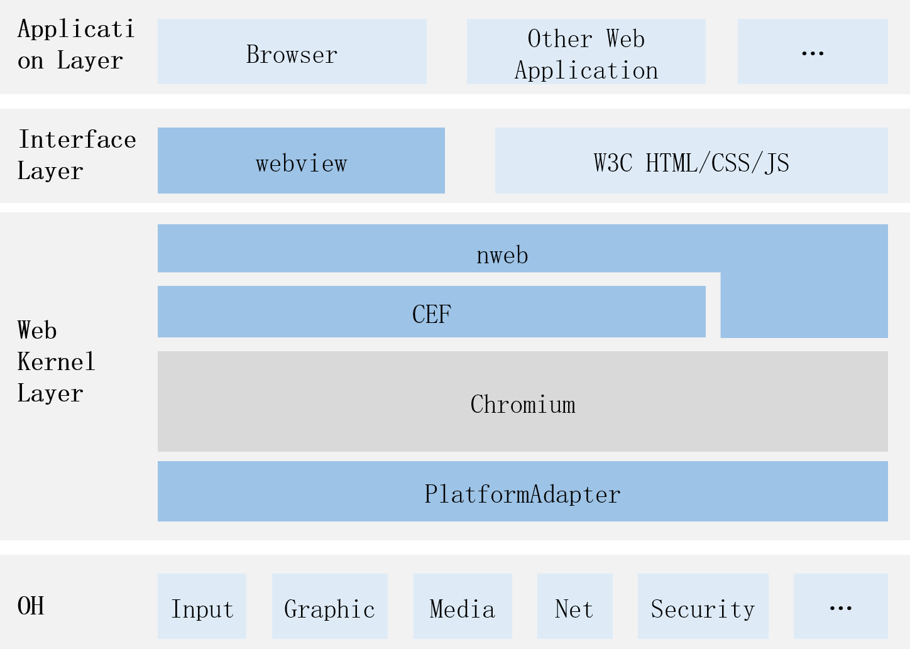

# web_webview

## Introduction

nweb is the native engine of the OpenHarmony webview component and is built based on Chromium and the Chromium Embedded Framework (CEF).

## Software Architecture

Below is the software architecture.



* Webview component: UI component in OpenHarmony.
* nweb: native engine of the OpenHarmony web component, which is built based on the Chromium Embedded Framework (CEF).
* CEF: stands for Chromium Embedded Framework. It is an open-source project based on Google Chromium.
* Chromium: an open-source web browser principally developed by Google and released under the BSD license and other permissive open-source licenses.

## Directory Structure

```
base/web/web_cangjie_api
├── ohos             # Cangjie webview code
├── kit              # Cangjie kit code
├── figures          # architecture pictures
```

## Repositories Involved

web_cangjie_api

[web_webview](https://gitee.com/openharmony/web_webview)
