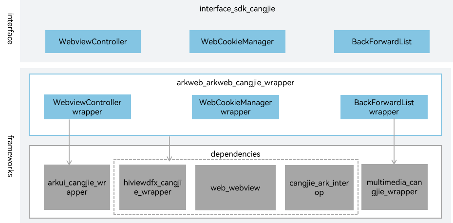

# arkweb_cangjie_wrapper

## Introduction

The Web Cangjie API is a Cangjie API encapsulated on OpenHarmony based on the arkweb capability. arkweb is the native engine of OpenHarmony webview components, built on Chromium and CEF.

## Software Architecture

Below is the software architecture.



* nweb: native engine of the OpenHarmony web component, which is built based on the Chromium Embedded Framework (CEF).
* CEF: stands for Chromium Embedded Framework. It is an open-source project based on Google Chromium.

## Directory Structure

```
base/web/arkweb_cangjie_wrapper
├── ohos             # Cangjie webview code
├── kit              # Cangjie kit code
├── figures          # architecture pictures
```

## Repositories Involved

[web_webview](https://gitee.com/openharmony/web_webview)
