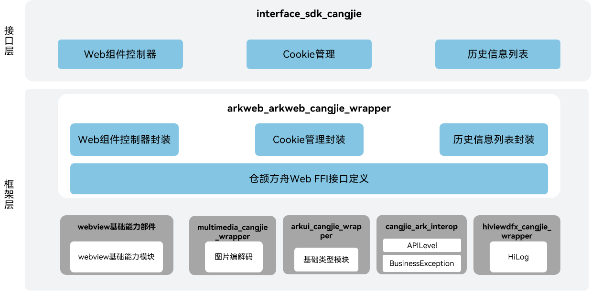

# Web仓颉接口

## 简介

Web仓颉接口是在 OpenHarmony 上基于 arkweb 能力之上封装的仓颉API。提供了Web组件控制器，Cookie管理和历史信息列表的能力。

## 系统架构

**图 1**  Web仓颉架构图



## 目录

```
base/web/arkweb_cangjie_wrapper
├── ohos             # 仓颉webview接口实现
├── kit              # 仓颉kit化代码
├── figures          # 存放readme中的架构图
```

## 约束

当前开放的Web仓颉接口仅支持standard设备。

## 使用说明

如架构图所示，Web仓颉接口提供了以下功能接口，开发者可以根据使用诉求，综合使用一类或多类接口：

  - BackForwardList：历史信息列表。
  - WebCookieManager：Cookie管理。
  - WebviewController：Web组件控制器。

与ArkTS相比，暂不支持以下功能：

  - AdsBlockManager：广告过滤配置。
  - BackForwardCacheOptions：前进后退缓存配置。
  - BackForwardCacheSupportedFeatures：前进后退缓存特性配置。
  - GeolocationPermissions：地理位置权限配置。
  - JsMessageExt：执行JavaScript脚本的结果。
  - MediaSourceInfo：媒体源信息配置。
  - NativeMediaPlayerSurfaceInfo：应用接管媒体播放时渲染信息。
  - PdfData：生成的PDF输出数据。
  - ProxyConfig：网络代理配置。
  - ProxyController：网络代理控制器。
  - WebDataBase：数据库管理。
  - WebDownloadDelegate：下载任务状态事件。
  - WebDownloadItem：下载任务。
  - WebDownloadManager：下载任务管理。
  - WebHttpBodyStream：HTTP请求体。
  - WebMessageExt：前端与应用通信数据对象。
  - WebResourceHandler：资源加载控制。
  - WebSchemeHandler：指定Scheme的请求拦截器。
  - WebSchemeHandlerRequest：通过拦截器拦截到的请求。
  - WebSchemeHandlerResponse：为拦截到的请求创建自定义响应。
  - WebStorageOrigin：Web组件存储操作接口。
  - NativeMediaPlayerBridge：托管网页媒体播放器桥接接口。
  - NativeMediaPlayerHandler：托管网页媒体播放器的事件接口。
  - WebMessagePort：网页前端与应用的消息端口。

方舟Web相关API请参见[ohos.web.webview](https://gitcode.com/openharmony-sig/arkcompiler_cangjie_ark_interop/blob/master/doc/API_Reference/source_zh_cn/apis/ArkWeb/cj-apis-webview.md)，相关指导请参见[方舟Web开发指南](https://gitcode.com/openharmony-sig/arkcompiler_cangjie_ark_interop/tree/master/doc/Dev_Guide/source_zh_cn/web)。

## 相关仓

[web_webview](https://gitee.com/openharmony/web_webview)

## 参与贡献

欢迎广大开发者贡献代码、文档等，具体的贡献流程和方式请参见[参与贡献](https://gitcode.com/openharmony/docs/blob/master/zh-cn/contribute/%E5%8F%82%E4%B8%8E%E8%B4%A1%E7%8C%AE.md)。
