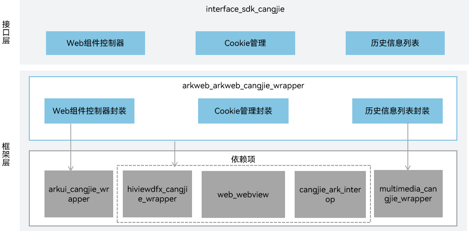

# Web仓颉接口

## 简介

Web仓颉接口是在OpenHarmony上基于方舟Web能力之上封装的仓颉API。提供了Web组件控制，Cookie管理和历史信息列表的能力。开发者可通过提供的能力控制Web组件的行为，查询网页访问历史记录，设置Cookie信息。当前开放的Web仓颉接口仅支持standard设备。

## 系统架构

**图 1**  Web仓颉架构图



如架构图所示：

- Web组件控制器：提供控制Web组件各种行为（包括页面导航、生命周期状态、JavaScript交互等行为）。
- Cookie管理：提供控制Web组件中Cookie的各种行为。
- 历史信息列表：提供获取历史列表中指定索引的历史记录项信息。
- 仓颉方舟Web FFI接口定义：负责定义C语言互操作仓颉接口，用于实现方舟Web的能力。
- webview基础能力：负责提供webview基础功能，封装C语言接口提供给仓颉进行互操作。

## 目录

```
base/web/arkweb_cangjie_wrapper
├── figures                                 # 存放README中的架构图
├── kit                                     # 仓颉ArkWeb的kit化代码
│   └── ArkWeb
├── ohos                                    # 仓颉方舟Web接口实现
│   └── web
│       └── webview
│           ├── back_forward_list.cj        # 历史信息列表
│           ├── web_cookie_manager.cj       # Cookie管理
│           └── webview_controller.cj       # Web组件控制器
└── test                                    # 仓颉方舟Web测试用例
    └── APILevel22
        └── webview                         # 仓颉方舟Web测试用例
```

## 使用说明

Web仓颉接口提供了以下功能接口，开发者可以根据诉求使用：

  - BackForwardList：历史信息列表。
  - WebCookieManager：Cookie管理。
  - WebviewController：Web组件控制器。

与ArkTS提供的API能力相比，暂不支持以下功能：

  - AdsBlockManager：广告过滤配置。
  - BackForwardCacheOptions：前进后退缓存配置。
  - BackForwardCacheSupportedFeatures：前进后退缓存特性配置。
  - GeolocationPermissions：地理位置权限配置。
  - JsMessageExt：执行JavaScript脚本的结果。
  - MediaSourceInfo：媒体源信息配置。
  - NativeMediaPlayerSurfaceInfo：应用接管媒体播放时渲染信息。
  - PdfData：生成的PDF输出数据。
  - ProxyConfig：网络代理配置。
  - ProxyController：网络代理控制器。
  - WebDataBase：数据库管理。
  - WebDownloadDelegate：下载任务状态事件。
  - WebDownloadItem：下载任务。
  - WebDownloadManager：下载任务管理。
  - WebHttpBodyStream：HTTP请求体。
  - WebMessageExt：前端与应用通信数据对象。
  - WebResourceHandler：资源加载控制。
  - WebSchemeHandler：指定Scheme的请求拦截器。
  - WebSchemeHandlerRequest：通过拦截器拦截到的请求。
  - WebSchemeHandlerResponse：为拦截到的请求创建自定义响应。
  - WebStorageOrigin：Web组件存储操作接口。
  - NativeMediaPlayerBridge：托管网页媒体播放器桥接接口。
  - NativeMediaPlayerHandler：托管网页媒体播放器的事件接口。
  - WebMessagePort：网页前端与应用的消息端口。

方舟Web相关API请参见[Web仓颉API文档](https://gitcode.com/openharmony-sig/arkcompiler_cangjie_ark_interop/blob/master/doc/API_Reference/source_zh_cn/apis/ArkWeb/cj-apis-webview.md)，相关指导请参见[方舟Web开发指南](https://gitcode.com/openharmony-sig/arkcompiler_cangjie_ark_interop/blob/master/doc/Dev_Guide/source_zh_cn/web/cj-web-component-overview.md)。

## 参与贡献

欢迎广大开发者贡献代码、文档等，具体的贡献流程和方式请参见[参与贡献](https://gitcode.com/openharmony/docs/blob/master/zh-cn/contribute/%E5%8F%82%E4%B8%8E%E8%B4%A1%E7%8C%AE.md)。

## 相关仓

[web_webview](https://gitcode.com/openharmony/web_webview)

[arkcompiler_cangjie_ark_interop](https://gitcode.com/openharmony-sig/arkcompiler_cangjie_ark_interop)

[arkui_arkui_cangjie_wrapper](https://gitcode.com/openharmony-sig/arkui_arkui_cangjie_wrapper)

[multimedia_multimedia_cangjie_wrapper](https://gitcode.com/openharmony-sig/multimedia_multimedia_cangjie_wrapper)

[hiviewdfx_hiviewdfx_cangjie_wrapper](https://gitcode.com/openharmony-sig/hiviewdfx_hiviewdfx_cangjie_wrapper)
